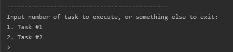
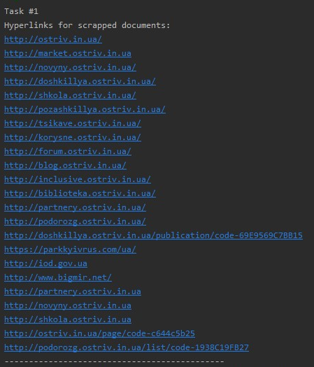
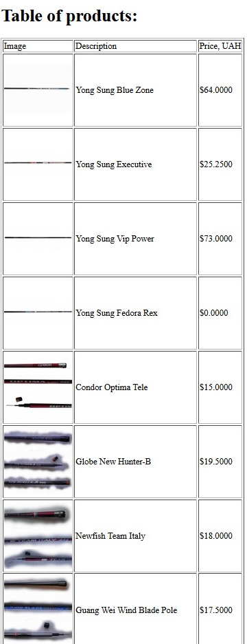

# Лабораторна робота No 1. Вивчення базових операцій обробки XML-документів

## Завдання

[Постановка завдання](http://scs.kpi.ua/sites/default/files/lab1_bd2-db2019_2020.docx.pdf)

## Варіант завдання

20 варіант згідно номера у списку групи

| Базова сторінка (завдання 1) | Зміст завдання 2     | Адреса інтернет-магазину (завдання 3) |
|------------------------------|----------------------|---------------------------------------|
| www.ostriv.in.ua        | Вивести список гіперпосилань | www.fishing-mart.com.ua |

## Лістинг коду

### Збирання даних зі сторінки www.ostriv.in.ua 

`src/scrapers/spiders/ostriv.py`

```python
class OstrivSpider(scrapy.Spider):
    name = 'ostriv'
    allowed_domains = ['ostriv.in.ua']
    start_urls = ['http://ostriv.in.ua/']

    def parse(self, response: Response):
        all_images = response.xpath("//img/@src[starts-with(., 'http')]")
        all_text = response.xpath(
            "//*[not(self::script)][not(self::style)][string-length(normalize-space(text())) > 30]/text()")
        all_links = response.xpath(
            "//a/@href[starts-with(., 'http')]")
        yield {
            'url': response.url,
            'payload': [{'type': 'text', 'data': text.get().strip()} for text in all_text] +
                       [{'type': 'image', 'data': image.get()} for image in all_images] +
                       [{'type': 'link', 'data': link.get()} for link in all_links]
        }

        if response.url == self.start_urls[0]:

            selected_links = [link.get() for link in all_links][:19]
            for link in selected_links:
                yield scrapy.Request(link, self.parse)
```

### Збирання даних зі сторінки www.fishing-mart.com.ua

`src/scrapers/spiders/fishmart.py`

```python
class FishmartSpider(scrapy.Spider):
    name = 'fishmart'
    allowed_domains = ['http://www.fishing-mart.com.ua/']
    start_urls = ['http://www.fishing-mart.com.ua/57-Fishing-mart-maxovie-udochki?id_category=57&n=24']

    def parse(self, response: Response):
        products = response.xpath("//li[contains(@class, 'ajax_block_product')]")[:20]
        for product in products:
            yield {
                'description': product.xpath(".//a[contains(@class, 'product-name')]/text()")[0].get(),
                'price': product.xpath(".//span[contains(@class, 'product-price')]/text()")[0].get(),
                'img': product.xpath(".//a[contains(@class, 'product_img_link')]/img/@src")[0].get()
            }
```

### Запис зібраних даних до файлів

`src/scrapers/pipelines.py`

```python
class ScrapersPipeline(object):
    def __init__(self):
        self.root = None

    def open_spider(self, spider):
        self.root = etree.Element("data" if spider.name == "ostriv" else "shop")

    def close_spider(self, spider):
        with open('task%d.xml' % (1 if spider.name == "ostriv" else 2), 'wb') as f:
            f.write(etree.tostring(self.root, encoding="UTF-8", pretty_print=True, xml_declaration=True))

    def process_item(self, item, spider):
        if spider.name == "ostriv":
            page = etree.Element("page", url=item["url"])
            for payload in item["payload"]:
                fragment = etree.Element("fragment", type=payload["type"])
                fragment.text = payload["data"]
                page.append(fragment)
            self.root.append(page)
        else:
            product = etree.Element("product")
            desc = etree.Element("description")
            desc.text = item["description"]
            pr = etree.Element("price")
            pr.text = item["price"]
            img = etree.Element("image")
            img.text = item["img"]
            product.append(desc)
            product.append(pr)
            product.append(img)
            self.root.append(product)
        return item
```

### Завдання №1

`src/main.py`

```python
def task1():
    print("Task #1")
    root = etree.parse("task1.xml")
    links = root.xpath("//fragment[@type='link']/text()")
    links = list(dict.fromkeys(links))
    print("Hyperlinks for scrapped documents:")
    for link in links:
        print(link)
```

### Завдання №2

`src/main.py`

```python
def task2():
    print("Task #2")
    transform = etree.XSLT(etree.parse("task2.xsl"))
    result = transform(etree.parse("task2.xml"))
    result.write("task2.xhtml", pretty_print=True, encoding="UTF-8")
    print("XHTML page will be opened in web-browser...")
    webbrowser.open('file://' + os.path.realpath("task2.xhtml"))
```

`src/task2.xsl`

```xml
<?xml version="1.0" encoding="UTF-8"?>
<xsl:stylesheet version="1.0" xmlns:xsl="http://www.w3.org/1999/XSL/Transform" xmlns="http://www.w3.org/1999/xhtml">
    <xsl:output
        method="xml"
        doctype-system="http://www.w3.org/TR/xhtml11/DTD/xhtml11.dtd"
        doctype-public="-//W3C//DTD XHTML 1.1//EN"
        indent="yes"
    />
    <xsl:template match="/">
        <html xml:lang="en">
            <head>
                <title>Task 2</title>
            </head>
            <body>
                <h1>Table of products:</h1>
                <xsl:apply-templates select="/shop"/>
                <xsl:if test="count(/shop/product) = 0">
                    <p>There are no products available</p>
                </xsl:if>
            </body>
        </html>
    </xsl:template>
    <xsl:template match="/shop">
        <table border="1">
            <thead>
                <tr>
                    <td>Image</td>
                    <td>Description</td>
                    <td>Price, UAH</td>
                </tr>
            </thead>
            <tbody>
                <xsl:apply-templates select="/shop/product"/>
            </tbody>
        </table>
    </xsl:template>
    <xsl:template match="/shop/product">
        <tr>
            <td>
                 <xsl:apply-templates select="image"/>
            </td>
            <td>
                <xsl:apply-templates select="description"/>
            </td>
            <td>
                <xsl:apply-templates select="price"/>
            </td>
        </tr>
    </xsl:template>
    <xsl:template match="image">
        
            <xsl:attribute name="src">
                <xsl:value-of select="text()"/>
            </xsl:attribute>
        </img>
    </xsl:template>
    <xsl:template match="price">
        <xsl:value-of select="text()"/>
    </xsl:template>
    <xsl:template match="description">
        <xsl:value-of select="text()"/>
    </xsl:template>
</xsl:stylesheet>
```

## Лістинг згенерованих файлів

### task1.xml

```xml
<?xml version='1.0' encoding='UTF-8'?>
<data>
  <page url="http://ostriv.in.ua/">
    <fragment type="text">Науково-практична конференція «Національна ідентичність як проблема науки й освіти»</fragment>
    <fragment type="text">XІ Міжнародна науково-практична конференція «Інноваційні технології навчання обдарованих дітей та молоді»</fragment>
    <fragment type="text">І Всеукраїнська науково-практична конференція «Музейна педагогіка в науковій освіті»</fragment>
    <fragment type="text">Науково-практична конференція «Національна ідентичність як проблема науки й освіти»</fragment>
    <fragment type="text">Шановні колеги!&#13;
Запрошуємо Вас взяти участь у роботі науково-практичної конференції «Національна ідентичність як проблема науки й освіти», яка відбудеться 12 березня 2020 року за адресою: м. Київ, вул. Івана Мазепи, 13, Київський Палац дітей та юнацтва, концертна зала....</fragment>
    <fragment type="text">Острів знань вітає всіх з Новим роком та Різдвом!</fragment>
    <fragment type="text">Година спілкування «Моя Батьківщина»</fragment>
    <fragment type="text">Виховання дітей засобами музики</fragment>
    <fragment type="text">Вечір цікавих дослідів з фізики</fragment>
    <fragment type="text">Наказ МОН України № 1191 від 01.11.2018</fragment>
    <fragment type="text">Наказ МОН України № 1190 від 01.11.2018</fragment>
    <fragment type="text">Лист МОН України № 1/9-656 від 30.10.2018</fragment>
    <fragment type="text">Наказ МОН України № 509 від 22.05.2018</fragment>
    <fragment type="text">Хто у МОН заробляє на предметних кабінетах</fragment>
    <fragment type="text">Науково-практична конференція «Національна ідентичність як проблема науки й освіти»</fragment>
    <fragment type="text">Шановні колеги!&#13;
Запрошуємо Вас взяти участь у роботі науково-практичної конференції «Національна ідентичність як проблема науки й освіти», яка відбудеться 12 березня 2020 року за адресою: м. Київ, вул. Івана Мазепи, 13, Київський Палац дітей та юнацтва, концертна зала....</fragment>
    <fragment type="text"></fragment>
    <fragment type="text">28 Січня 2020, 16:31.
                Переглядів: 232</fragment>
    <fragment type="text">Острів знань вітає всіх з Новим роком та Різдвом!</fragment>
    <fragment type="text">З Новим роком, з новими починаннями й новими успіхами. Бажаємо новорічної радості і непередбачуваного дива, чарівної історії і яскравих, веселих моментів. Нехай Новий рік подарує світлу надію і великі сили, виконає всі добрі бажання! Нехай вас переповнює жага до нових звершень, енергія та щира радість від життя!...</fragment>
    <fragment type="text"></fragment>
    <fragment type="text">02 Січня 2020, 12:30.
                Переглядів: 589</fragment>
    <fragment type="text">І Всеукраїнська науково-практична конференція «Музейна педагогіка в науковій освіті»</fragment>
    <fragment type="text">Шановні колеги! Запрошуємо Вас взяти участь у роботі І Всеукраїнської науково-практичної конференції «Музейна педагогіка в науковій освіті», що відбудеться 28 листопада 2019 року (четвер) у м. Києві....</fragment>
    <fragment type="text"></fragment>
    <fragment type="text">12 Листопада 2019, 17:58.
                Переглядів: 1494</fragment>
    <fragment type="text">Віртуальна співбесіда з учасниками І-го етапу відбірково-тренувальних зборів – «ICYS-Україна»</fragment>
    <fragment type="text">Віртуальна співбесіда з учасниками І-го етапу відбірково-тренувальних зборів – «ICYS-Україна» відбулася 23 та 25 жовтня 2019 року. Учасники представляли власні проекти з чьотирьох напрямів: інженерія, екологія, математика, фізика, інформатика. ...</fragment>
    <fragment type="text"></fragment>
    <fragment type="text">30 Жовтня 2019, 20:27.
                Переглядів: 1350</fragment>
    <fragment type="text">Міжнародний науково-практичний семінар «СИСТЕМА ЛЮСТРА*:МЕТОДОЛОГІЯ, ТЕХНОЛОГІЯ, ВПРОВАДЖЕННЯ»</fragment>
    <fragment type="text">Шановні колеги! Запрошуємо Вас взяти участь у роботі Міжнародного науково-практичного семінару «СИСТЕМА ЛЮСТРА*: МЕТОДОЛОГІЯ, ТЕХНОЛОГІЯ, ВПРОВАДЖЕННЯ» 7 жовтня 2019 року, м. Київ....</fragment>
    <fragment type="text"></fragment>
    <fragment type="text">26 Вересня 2019, 17:14.
                Переглядів: 1683</fragment>
    <fragment type="text">XІ Міжнародна науково-практична конференція «Інноваційні технології навчання обдарованих дітей та молоді»</fragment>
    <fragment type="text">Конференція проводиться 10–13 жовтня 2019 року у м. Одеса в програмі Першого Всеукраїнського відкритого науково-практичного форуму «Інноваційні трансформації в сучасній освіті: виклики, реалії, стратегії»...</fragment>
    <fragment type="text"></fragment>
    <fragment type="text">11 Вересня 2019, 15:07.
                Переглядів: 2173</fragment>
    <fragment type="text">Науково-практичний семінар «Розроблення спеціальних освітніх програм для обдарованих дітей, схильних до дослідницької діяльності»</fragment>
    <fragment type="text">Шановні колеги! Запрошуємо Вас взяти участь у роботі Науково-практичного семінару «Розроблення спеціальних освітніх програм для обдарованих дітей, схильних до дослідницької діяльності» 25 вересня 2019 року, м. Київ...</fragment>
    <fragment type="text"></fragment>
    <fragment type="text">04 Вересня 2019, 17:25.
                Переглядів: 2640</fragment>
    <fragment type="text">Острів знань вітає всіх з 1 вересня!</fragment>
    <fragment type="text">Дорогі друзі! Вітаємо Вас із чудовим хвилюючим святом - Днем Знань!...</fragment>
    <fragment type="text"></fragment>
    <fragment type="text">01 Вересня 2019, 00:00.
                Переглядів: 9374</fragment>
    <fragment type="text">XХVІІ Міжнародна конференція юних дослідників International Conference of Young Scientists (ICYS-2020), м. Белград (Сербія)</fragment>
    <fragment type="text">З метою цілеспрямованої, комплексної підготовки учнів до участі у Міжнародній конференції «ICYS - 2020» та формування команди від України, Національний центр «Мала академія наук України» та Інститут обдарованої дитини Національної академії педагогічних наук України за підтримки ДНУ «Інститут модернізації змісту освіти», проводять національний етап Конференції, відбірково-тренувальні збори «ICYS-Україна»....</fragment>
    <fragment type="text"></fragment>
    <fragment type="text">23 Серпня 2019, 13:18.
                Переглядів: 1793</fragment>
    <fragment type="text">Тренінг розвитку і формування інтелектуальних здібностей, культурної обізнаності, підприємливості, креативності, цифрової творчості, лідерства  необхідних дитині для успішного життя</fragment>
    <fragment type="text">За результатами проведення наукових досліджень фахівцями Інституту обдарованої дитини Національної академії педагогічний наук України розроблено тренінг розвитку і формування інтелектуальних здібностей, культурної обізнаності, підприємливості, креативності, цифрової творчості, лідерства  необхідних дитині для успішного життя....</fragment>
    <fragment type="text"></fragment>
    <fragment type="text">15 Липня 2019, 22:07.
                Переглядів: 2132</fragment>
    <fragment type="text">Єдина пряма інформація про Ганнібала утримується у творах римлян, що поважали, боялися і ненавиділи ворога.</fragment>
    <fragment type="text">Година спілкування «Моя Батьківщина»</fragment>
    <fragment type="text">Виховання дітей засобами музики</fragment>
    <fragment type="text">Вечір цікавих дослідів з фізики</fragment>
    <fragment type="text">Проектна діяльність учнів на уроках креслення</fragment>
    <fragment type="text">Урок  з елементами проблемного навчання</fragment>
    <fragment type="text">Останній коментар: 31 Січня 2020, 14:19</fragment>
    <fragment type="text">Недавно приезжал брат с семьей, дома на тот момент практически ничего не было поесть. Заказали еду...</fragment>
    <fragment type="text">Останній коментар: 31 Січня 2020, 10:58</fragment>
    <fragment type="text">Выбирали игрушки здесь https://panama.ua/</fragment>
    <fragment type="text">Останній коментар: 31 Січня 2020, 10:56</fragment>
    <fragment type="text">Вот здесь можно выбрать бойлер на любой вкус...</fragment>
    <fragment type="text">Останній коментар: 31 Січня 2020, 10:43</fragment>
    <fragment type="text">краще Буковеля ще нічого не придумали https://bukovel.com/</fragment>
    <fragment type="text">Останній коментар: 31 Січня 2020, 09:19</fragment>
    <fragment type="text">Если честно, то я и не знал, что на розетке есть такая услуга. Я буду заказывать для детей, хочу...</fragment>
    <fragment type="image">http://images.ostriv.in.ua/preview/120x120/images/publications/4/22158/1580221683.jpg</fragment>
    <fragment type="image">http://images.ostriv.in.ua/preview/120x120/images/publications/4/22157/1577960606.gif</fragment>
    <fragment type="image">http://images.ostriv.in.ua/preview/120x120/images/publications/4/22155/1573573889.jpg</fragment>
    <fragment type="image">http://images.ostriv.in.ua/preview/120x120/images/publications/4/22154/1572459918.jpg</fragment>
    <fragment type="image">http://images.ostriv.in.ua/preview/120x120/images/publications/4/22153/1569508968.jpg</fragment>
    <fragment type="image">http://images.ostriv.in.ua/preview/120x120/images/publications/4/22152/1568203666.jpg</fragment>
    <fragment type="image">http://images.ostriv.in.ua/preview/120x120/images/publications/4/22151/1567606678.jpg</fragment>
    <fragment type="image">http://images.ostriv.in.ua/preview/120x120/images/publications/4/8720/1567609894.jpg</fragment>
    <fragment type="image">http://images.ostriv.in.ua/preview/120x120/images/publications/4/22150/1566555328.jpg</fragment>
    <fragment type="image">http://images.ostriv.in.ua/preview/120x120/images/publications/4/22149/1563207462.jpg</fragment>
    <fragment type="image">http://c.bigmir.net/?v16893066&amp;s16893066&amp;t2</fragment>
    <fragment type="link">http://ostriv.in.ua/</fragment>
    <fragment type="link">http://market.ostriv.in.ua</fragment>
    <fragment type="link">http://novyny.ostriv.in.ua/</fragment>
    <fragment type="link">http://doshkillya.ostriv.in.ua/</fragment>
    <fragment type="link">http://shkola.ostriv.in.ua/</fragment>
    <fragment type="link">http://pozashkillya.ostriv.in.ua/</fragment>
    <fragment type="link">http://tsikave.ostriv.in.ua/</fragment>
    <fragment type="link">http://korysne.ostriv.in.ua/</fragment>
    <fragment type="link">http://forum.ostriv.in.ua/</fragment>
    <fragment type="link">http://blog.ostriv.in.ua/</fragment>
    <fragment type="link">http://inclusive.ostriv.in.ua/</fragment>
    <fragment type="link">http://biblioteka.ostriv.in.ua/</fragment>
    <fragment type="link">http://blog.ostriv.in.ua/</fragment>
    <fragment type="link">http://doshkillya.ostriv.in.ua/</fragment>
    <fragment type="link">http://korysne.ostriv.in.ua/</fragment>
    <fragment type="link">http://novyny.ostriv.in.ua/</fragment>
    <fragment type="link">http://partnery.ostriv.in.ua/</fragment>
    <fragment type="link">http://podorozg.ostriv.in.ua/</fragment>
    <fragment type="link">http://pozashkillya.ostriv.in.ua/</fragment>
    <fragment type="link">http://forum.ostriv.in.ua/</fragment>
    <fragment type="link">http://tsikave.ostriv.in.ua/</fragment>
    <fragment type="link">http://shkola.ostriv.in.ua/</fragment>
    <fragment type="link">http://doshkillya.ostriv.in.ua/publication/code-69E9569C7BB15</fragment>
    <fragment type="link">http://novyny.ostriv.in.ua/</fragment>
    <fragment type="link">https://parkkyivrus.com/ua/</fragment>
    <fragment type="link">http://inclusive.ostriv.in.ua/</fragment>
    <fragment type="link">http://biblioteka.ostriv.in.ua/</fragment>
    <fragment type="link">http://blog.ostriv.in.ua/</fragment>
    <fragment type="link">http://doshkillya.ostriv.in.ua/</fragment>
    <fragment type="link">http://korysne.ostriv.in.ua/</fragment>
    <fragment type="link">http://novyny.ostriv.in.ua/</fragment>
    <fragment type="link">http://partnery.ostriv.in.ua/</fragment>
    <fragment type="link">http://podorozg.ostriv.in.ua/</fragment>
    <fragment type="link">http://pozashkillya.ostriv.in.ua/</fragment>
    <fragment type="link">http://forum.ostriv.in.ua/</fragment>
    <fragment type="link">http://tsikave.ostriv.in.ua/</fragment>
    <fragment type="link">http://shkola.ostriv.in.ua/</fragment>
    <fragment type="link">http://iod.gov.ua</fragment>
    <fragment type="link">http://www.bigmir.net/</fragment>
  </page>
  ...
</data>

```

### task2.xml

```xml
<?xml version='1.0' encoding='UTF-8'?>
<shop>
  <product>
    <description> Yong Sung Blue Zone </description>
    <price> $64.0000 </price>
    <image>http://www.fishing-mart.com.ua/2115-home_default/yong-sung-blue-zone.jpg</image>
  </product>
  <product>
    <description> Yong Sung Executive </description>
    <price> $25.2500 </price>
    <image>http://www.fishing-mart.com.ua/2116-home_default/yong-sung-executive.jpg</image>
  </product>
  <product>
    <description> Yong Sung Vip Power </description>
    <price> $73.0000 </price>
    <image>http://www.fishing-mart.com.ua/2117-home_default/yong-sung-vip-power.jpg</image>
  </product>
  <product>
    <description> Yong Sung Fedora Rex </description>
    <price> $0.0000 </price>
    <image>http://www.fishing-mart.com.ua/2118-home_default/yong-sung-fedora-rex.jpg</image>
  </product>
  <product>
    <description> Condor Optima Tele </description>
    <price> $15.0000 </price>
    <image>http://www.fishing-mart.com.ua/6203-home_default/condor-optima-tele.jpg</image>
  </product>
</shop>
```

### task2.xhtml

```xhtml
<!DOCTYPE html PUBLIC "-//W3C//DTD XHTML 1.1//EN" "http://www.w3.org/TR/xhtml11/DTD/xhtml11.dtd">
<html xmlns="http://www.w3.org/1999/xhtml" xml:lang="en">
  <head>
    <title>Task 2</title>
  </head>
  <body>
    <h1>Table of products:</h1>
    <table border="1">
      <thead>
        <tr>
          <td>Image</td>
          <td>Description</td>
          <td>Price, UAH</td>
        </tr>
      </thead>
      <tbody>
        <tr>
          <td>
            
          </td>
          <td> Yong Sung Blue Zone </td>
          <td> $64.0000 </td>
        </tr>
        <tr>
          <td>
            
          </td>
          <td> Yong Sung Executive </td>
          <td> $25.2500 </td>
        </tr>
        <tr>
          <td>
            
          </td>
          <td> Yong Sung Vip Power </td>
          <td> $73.0000 </td>
        </tr>
        <tr>
          <td>
            
          </td>
          <td> Yong Sung Fedora Rex </td>
          <td> $0.0000 </td>
        </tr>
        <tr>
          <td>
            
          </td>
          <td> Condor Optima Tele </td>
          <td> $15.0000 </td>
        </tr>
      </tbody>
    </table>
  </body>
</html>

```

## Приклади роботи програми






