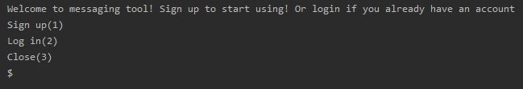
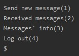
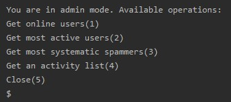
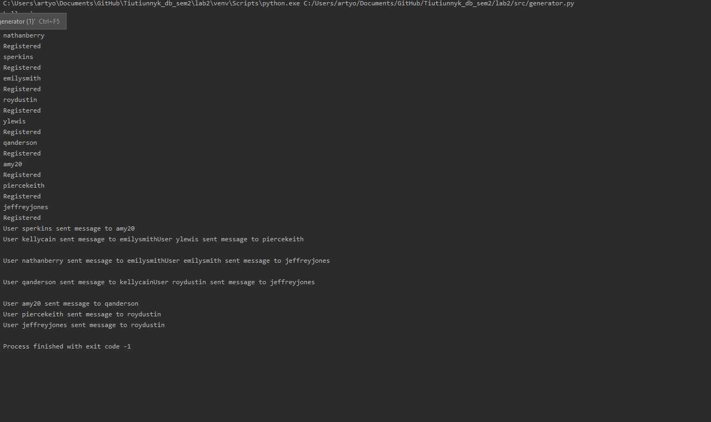

# Лабораторна робота No2.Практика використання сервера Redis
## Завдання

[Постановка завдання](http://scs.kpi.ua/sites/default/files/lab2_bd2-db2019_2020.pdf)

## Обґрунтування вибору структур даних:
Користувачі зберігаються у структурі даних множина (Set), оскільки це найпростіша структура
з швидкістю пошуку O(1).

Повідомлення зберігаються в хештаблиці (Hash), оскільки вона зберігає дані в парі ключ - значення,
 що дозволяє доступатись до окремого повідомлення за унікальним ключем.
В якості ключа виступає message_id, а в якості значення структура,
 яка зберігає статус, текст та ідентифікатори відправника й отримувача.
 

Для черги повідомлень використовується список (List),
 оскільки він має високу швидкість додавання та вилучення елементів(О(1)),
 що є бажаним для черги

 
 
 ## Приклад роботи
 
 ### Інтерфейс входу користувача

 
 ### Функціонал користувача
 
 
 ### Функціонал адміністратора
 
 
 ### Демонстрація роботи генератора
 
